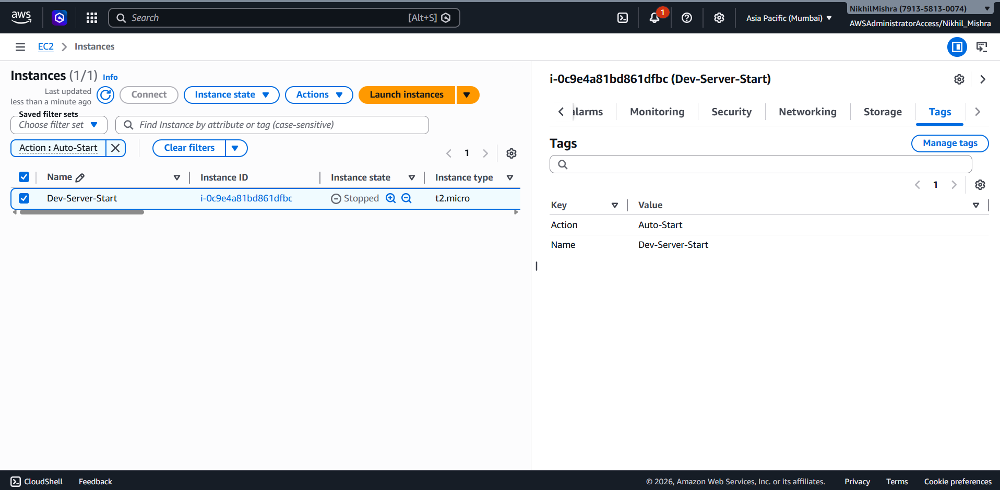
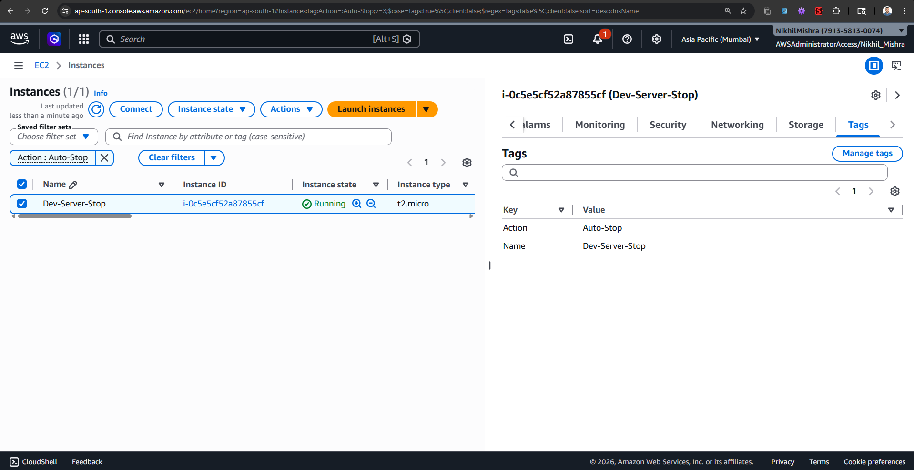
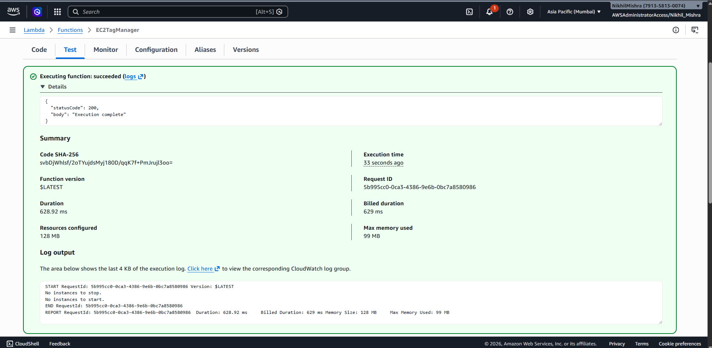
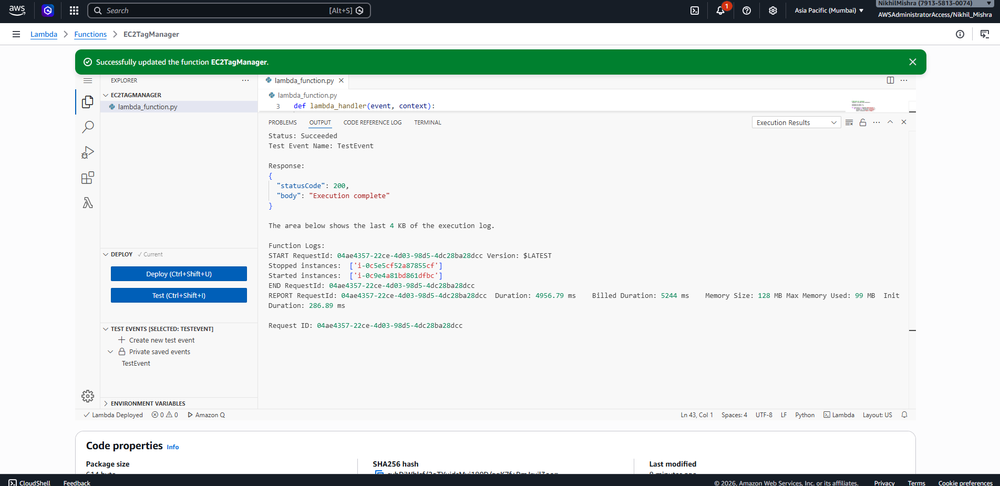
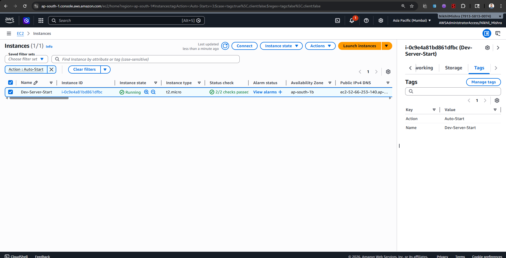
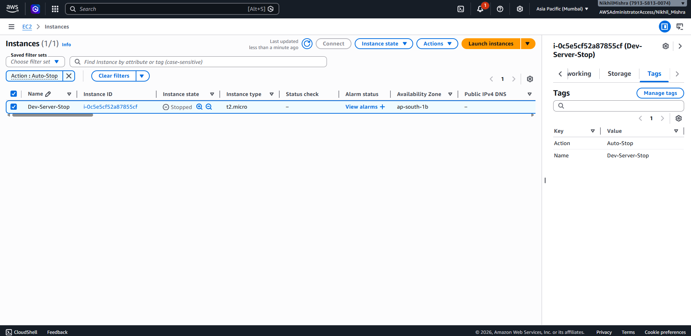

# Assignment 1: Automated Instance Management Using AWS Lambda and Boto3

## Objective
The goal of this assignment is to automatically stop and start EC2 instances based on their tags using an AWS Lambda function running a Boto3 Python script.

## Steps Followed

### 1. EC2 Setup
1. I navigated to the EC2 Dashboard and launched two `t2.micro` instances.
2. I added tags during the launch process:
   - For the first instance, Key: `Action`, Value: `Auto-Stop`.
   - For the second instance, Key: `Action`, Value: `Auto-Start`.

**Initial State (Tags & Status):**

### 2. Lambda IAM Role
1. I went to the IAM Dashboard and created a new role.
2. I selected AWS service and then Lambda as the trusted entity.
3. I attached the `AmazonEC2FullAccess` permissions policy.
4. I assigned a name to the role and saved it.

### 3. Lambda Function Setup
1. I opened the Lambda Dashboard and clicked "Create function".
2. I chose Python 3.9 as the runtime environment.
3. Under "Execution role", I selected "Use an existing role" and chose the IAM role I created earlier.
4. I wrote the required Boto3 Python script in `lambda_function.py` to identify instances by tags and control their states accordingly.
5. I clicked "Deploy" to save the changes.

### 4. Testing the Function
1. In the EC2 Dashboard, I made sure the `Auto-Stop` instance was running and the `Auto-Start` instance was stopped.
2. Back in the Lambda interface, I clicked the "Test" button to trigger the function manually.
3. I checked the Execution Results log to confirm the correct instance IDs were printed and the function ran without errors.
4. Finally, I refreshed the EC2 Dashboard and verified that the instance states had swapped accordingly.

**Lambda Execution Logs:**

**Final State (After Lambda Execution):**

## Source Code
The Python script I created for this assignment is located in the `lambda_function.py` file within this directory.
