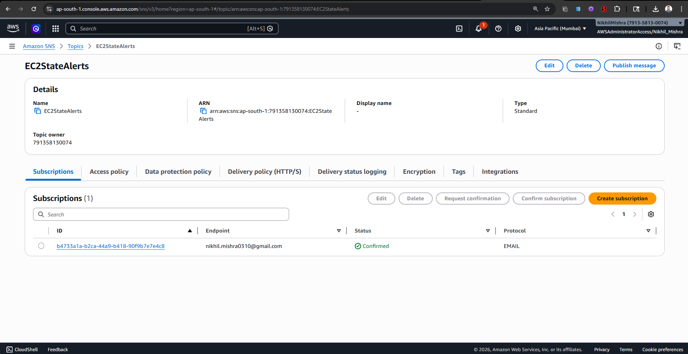
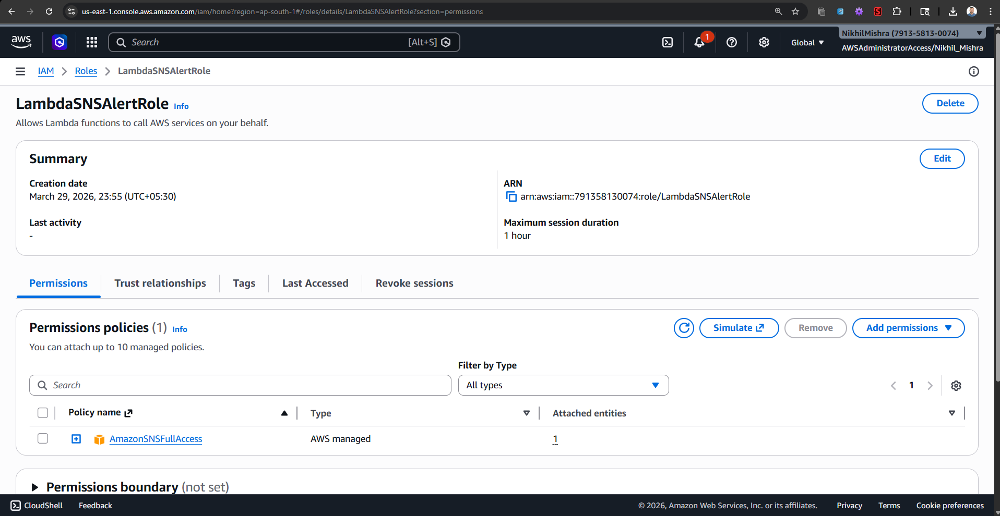
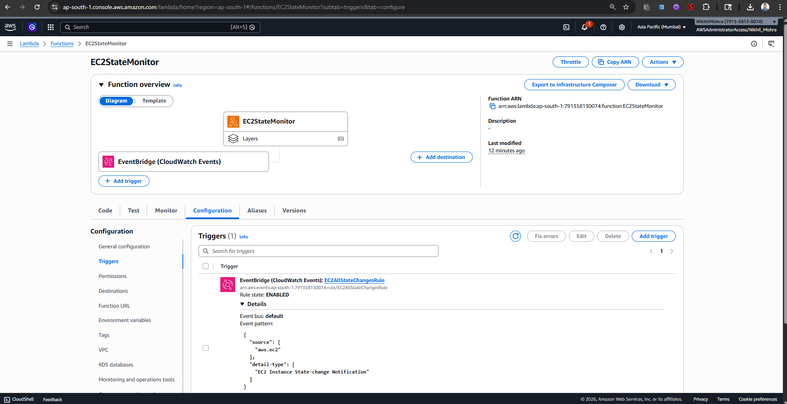
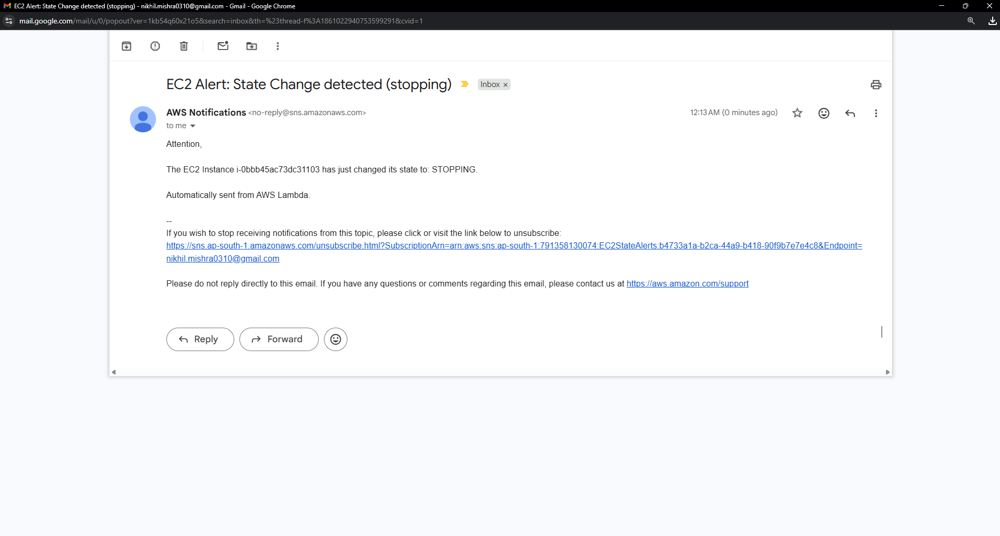

# Assignment 14: Monitor EC2 Instance State Changes

## Objective
The goal is to monitor an EC2 instance's state changes (such as stopping, starting, or terminating) and automatically send an email alert to an administrator using AWS SNS and Lambda via EventBridge.

## Steps Followed

### 1. Amazon SNS Setup
1. I navigated to the SNS Dashboard and created a new Standard topic named `EC2StateAlerts`.
2. I created a new Subscription for this topic using the `Email` protocol.
3. I entered my email address, and then confirmed the subscription by clicking the link sent to my email inbox.
4. I noted down the Topic ARN for the Lambda function.

### 2. IAM Role for Lambda
1. I went to the IAM Dashboard and created a new role.
2. I selected AWS service and then Lambda as the trusted entity.
3. I attached the `AmazonSNSFullAccess` policy so the function can publish the alerts.
4. I named the role `LambdaSNSAlertRole` and created it.

### 3. Lambda Function Creation
1. I created a new Lambda function named `EC2StateMonitor` using Python 3.12.
2. I assigned the execution role to my new `LambdaSNSAlertRole`.
3. I replaced the default code with my custom Python script.
4. I updated the `SNS_TOPIC_ARN` variable in the script with my actual topic's ARN and deployed the function.

### 4. EventBridge (CloudWatch Events) Setup
1. In the Lambda function overview, I added a new trigger and selected **EventBridge (CloudWatch Events)**.
2. I created a new rule named `EC2AllStateChangesRule`.
3. For the event pattern, I selected `AWS` -> `EC2` -> `EC2 Instance State-change Notification` and chose `Any state`.
4. I clicked Add to complete the wiring.

### 5. Testing the Automation
1. To test the monitoring system, I went to the EC2 Dashboard.
2. I selected one of my running instances and issued a "Stop instance" command.
3. Because I had the trigger set to "Any state", the state change from "running" to "stopping" triggered the function immediately.
4. I checked my email inbox and found the automated alert message delivered from AWS SNS with the correct instance ID and state.

## Source Code
The script written for this automation is located in `lambda_function.py` within this directory.
