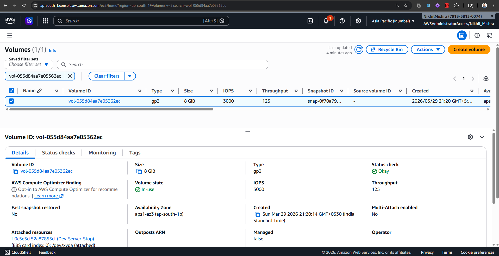
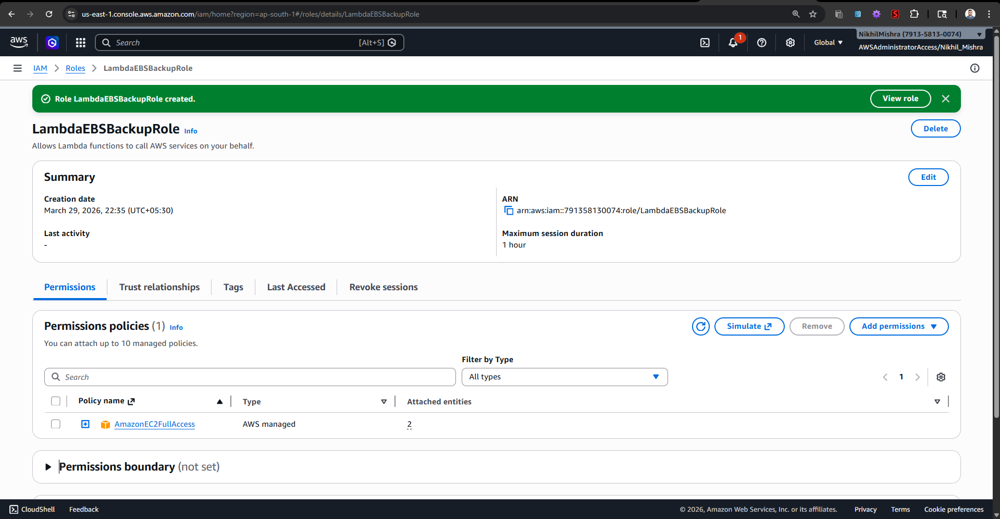
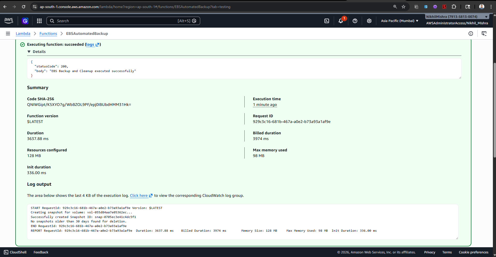
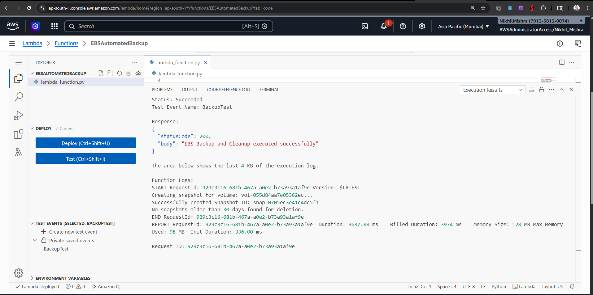
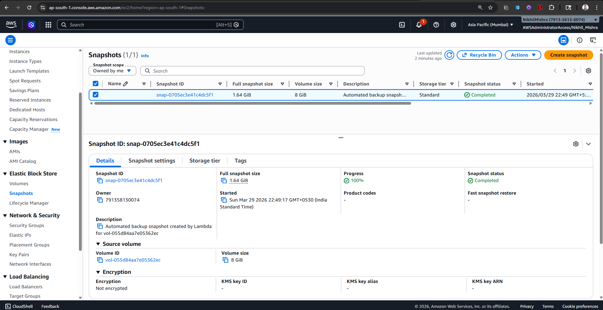

# Assignment 4: Automatic EBS Snapshot and Cleanup

## Objective
The goal is to automate the backing up of EBS volumes by creating a snapshot and ensuring that snapshots older than a specified retention period (30 days) are deleted to save costs.

## Steps Followed

### 1. EBS Volume Setup
1. I navigated to the EC2 Dashboard and went to **Elastic Block Store -> Volumes**.
2. I identified the Volume ID I wanted to back up (e.g., `vol-0...`) and copied it.

### 2. Lambda IAM Role
1. I went to the IAM Dashboard and created a new role.
2. I selected AWS service and then Lambda as the trusted entity.
3. I attached the `AmazonEC2FullAccess` permissions policy since it allows creating and deleting snapshots.
4. I named the role `LambdaEBSBackupRole` and created it.

### 3. Lambda Function Setup
1. I opened the Lambda Dashboard and clicked "Create function".
2. I named the function `EBSAutomatedBackup` and chose Python 3.12 as the runtime.
3. I configured the execution role to use the existing `LambdaEBSBackupRole`.
4. I wrote the Boto3 Python script to initialize the EC2 client, create snapshots, and clean up older ones.
5. In the script, I updated the `VOLUME_ID` variable with my actual volume ID.
6. Under **Configuration -> General configuration**, I edited the Timeout to be **15 seconds** to prevent timeout errors.
7. I clicked "Deploy".

### 4. Testing the Function
1. I clicked the "Test" button and created a generic test event.
2. I ran the test and checked the "Execution results" logs to confirm that the snapshot was created successfully.
3. Finally, I navigated to the EC2 Dashboard -> Snapshots to verify the new snapshot was present.

**Lambda Execution Logs:**

**EC2 Dashboard Verification:**

## Source Code
The Python script developed for this automation is saved in `lambda_function.py` within this directory.
