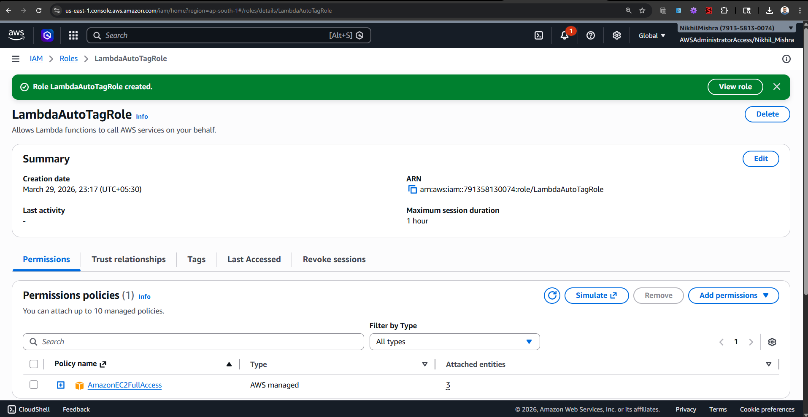
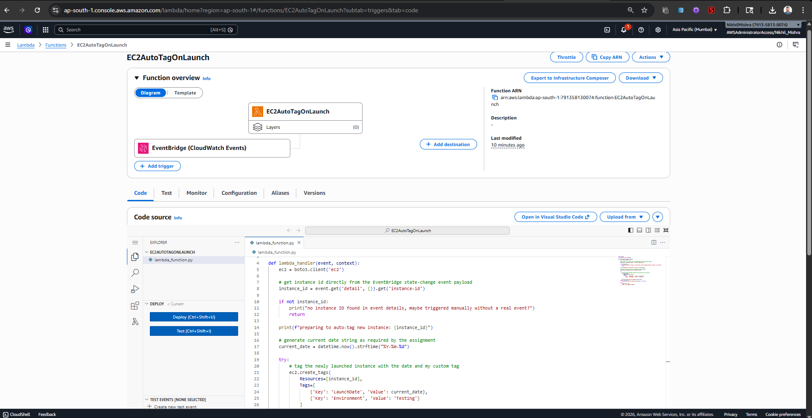
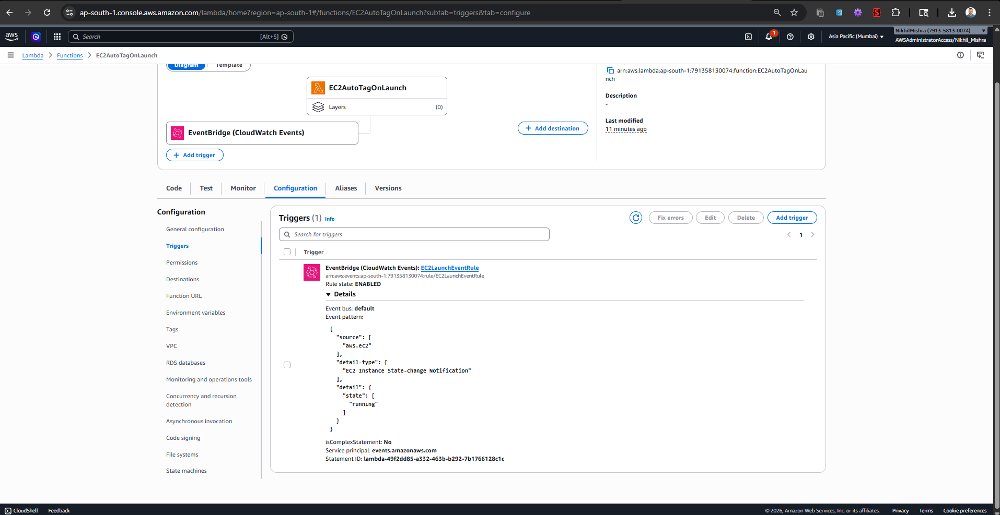
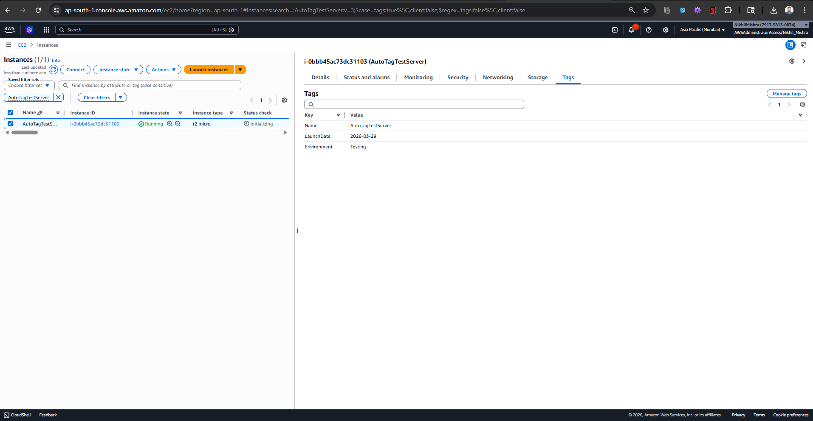

# Assignment 5: Auto-Tagging EC2 Instances on Launch

## Objective
The objective is to automate the tagging of EC2 instances as soon as they are launched to ensure better resource tracking. The function tags any newly launched instance with the current date and a custom tag.

## Steps Followed

### 1. IAM Role for Lambda
1. I navigated to the IAM Dashboard and created a new role for Lambda.
2. I attached the `AmazonEC2FullAccess` policy so the function has permission to describe and create tags on instances.
3. I named the role `LambdaAutoTagRole` and created it.

### 2. Lambda Function Creation
1. I went to the Lambda Dashboard and created a new function from scratch named `EC2AutoTagOnLaunch`.
2. I chose Python 3.12 as the runtime and assigned the `LambdaAutoTagRole` I just created.
3. I wrote my Boto3 script to extract the instance ID from the EventBridge event and apply the custom tags.
4. I saved and deployed the code.

### 3. CloudWatch Events (EventBridge) Setup
To automatically trigger this rule, I needed to set up an EventBridge trigger:
1. On the Lambda function overview screen, I clicked **Add trigger**.
2. I selected **EventBridge (CloudWatch Events)** as the source.
3. I chose to create a new rule named `EC2LaunchEventRule`.
4. For the Rule type, I selected **Event pattern** and built a pattern for EC2 Instance State-change Notification when the state is `running`.
5. I clicked Add.

### 4. Testing the Automation
1. To fully test this, I went to the EC2 Dashboard and manually launched a brand new `t2.micro` instance. I made sure **not** to add any tags during the setup to prove the automation works.
2. Once the instance state changed to "Running", I selected it and checked the "Tags" tab in the details pane.
3. The tags `LaunchDate` and `Environment` were automatically applied by my Lambda function exactly as programmed!

## Source Code
The script written for this automation is located in `lambda_function.py` within this directory.
